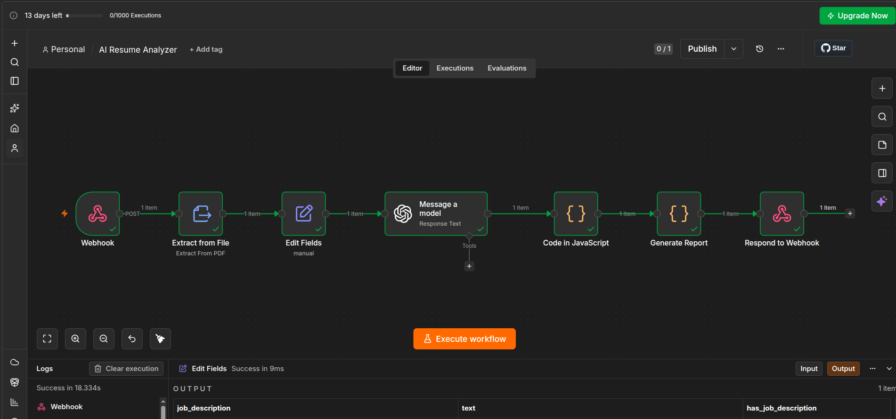
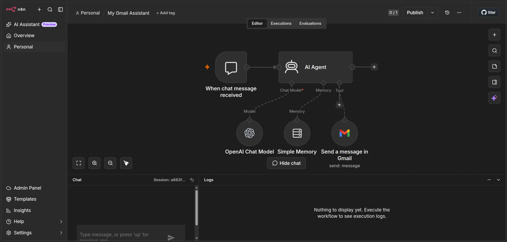
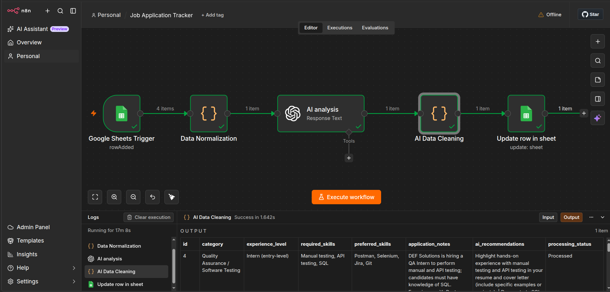

# AI-Workflow-Automation-Projects

A collection of reusable n8n automation projects and example workflows.

## Contents

- **ai-customer-support-automation** — an n8n workflow that automates customer support ticket classification, knowledge-base lookup, AI response generation, and ClickUp escalation. See [ai-customer-support-automation/README.md](ai-customer-support-automation/README.md) for full details.
- **ai-resume-analyzer** — an n8n workflow that analyzes resumes using AI. See [ai-resume-analyzer/README.md](ai-resume-analyzer/README.md) for full details.
- **gmail-assistant** — an n8n workflow that drafts and optionally sends Gmail messages through an AI-powered chat assistant. See [gmail-assistant/README.md](gmail-assistant/README.md) for full details.
- **job-application-tracker** — an n8n workflow that tracks and analyzes job applications using Google Sheets and OpenAI. See [job-application-tracker/README.md](job-application-tracker/README.md) for full details.
- **patient-care-clickup-automation** — a ClickUp + n8n workflow for assisted-living facility operations, including relative visit scheduling, location-based weather retrieval, and automated email notifications. See [patient-care-clickup-automation/README.md](patient-care-clickup-automation/README.md) for full details.

## Quickstart

Prerequisites:

- Install n8n (desktop, cloud, or Docker). See https://n8n.io for options.

Run a local n8n instance with Docker:

```bash
docker run -it --rm --name n8n -p 5678:5678 -v ~/.n8n:/home/node/.n8n n8nio/n8n
```

### Importing a workflow

1. Open the n8n editor at http://localhost:5678.
2. Click the workflow menu (top-right) → `Import from file` and choose the workflow JSON file.
3. Inspect credentials and nodes, update any API keys or secrets, then activate/run the workflow.

Example workflow: [patient-care-clickup-automation/workflow/relative-visit-weather.json](patient-care-clickup-automation/workflow/relative-visit-weather.json)

## Projects

### AI Customer Support Automation
- Location: [ai-customer-support-automation](ai-customer-support-automation)
- Purpose: Automates ticket classification, knowledge-base lookup, AI response generation, and ClickUp escalation for customer support.


### AI Resume Analyzer
- Location: [ai-resume-analyzer](ai-resume-analyzer)
- Purpose: Demonstrates using AI to parse and score resumes inside an n8n workflow. Includes example screenshots and a sample output JSON.



### Gmail Assistant
- Location: [gmail-assistant](gmail-assistant)
- Purpose: Provides a conversational email assistant that drafts and optionally sends Gmail messages through n8n.



### Job Application Tracker
- Location: [job-application-tracker](job-application-tracker)
- Purpose: Tracks job applications with Google Sheets, analyzes job descriptions with OpenAI, and writes structured recommendations back to the spreadsheet.



### Patient Care — ClickUp + n8n
- Location: [patient-care-clickup-automation](patient-care-clickup-automation)
- Purpose: Demonstrates an end-to-end assisted-living operations system built with ClickUp and n8n. ClickUp manages daily care tasks, medication administration, sales CRM, relatives, and visits. n8n automates relative-visit processing, creates Visit tasks, retrieves visit-day weather from Open-Meteo using each relative's latitude/longitude, and sends personalized Gmail notifications.


**Suggested project screenshots:**
- ClickUp workspace / operations structure
- Daily care task with recurring checklist
- Medication administration task
- Sales CRM pipeline
- Sales dashboard
- Relatives and Visits Lists
- n8n workflow
- Successful n8n execution
- Generated ClickUp Visit task
- Received weather notification email

## Contributing

Contributions, fixes, and improvements are welcome. Please open issues or pull requests describing the change. Keep each PR focused and include usage notes or test steps when applicable.

When adding new workflows:

- Add a top-level folder for the project.
- Include a `workflow/` directory with the exported workflow JSON.
- Add a README inside the project folder explaining required credentials, expected inputs, and example outputs.
- Add a `screenshots/` directory with representative workflow and result screenshots.

## License

This repository is licensed under the terms in the [LICENSE](LICENSE) file.

## Contact

If you have questions or want help integrating a workflow, open an issue or contact the repository owner.
