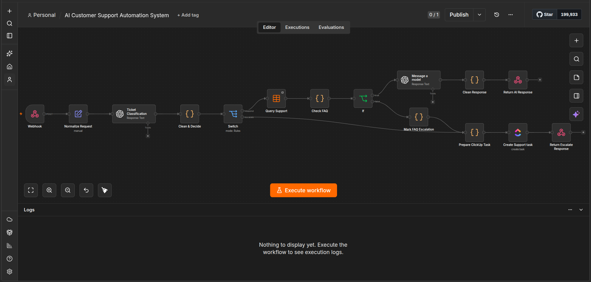
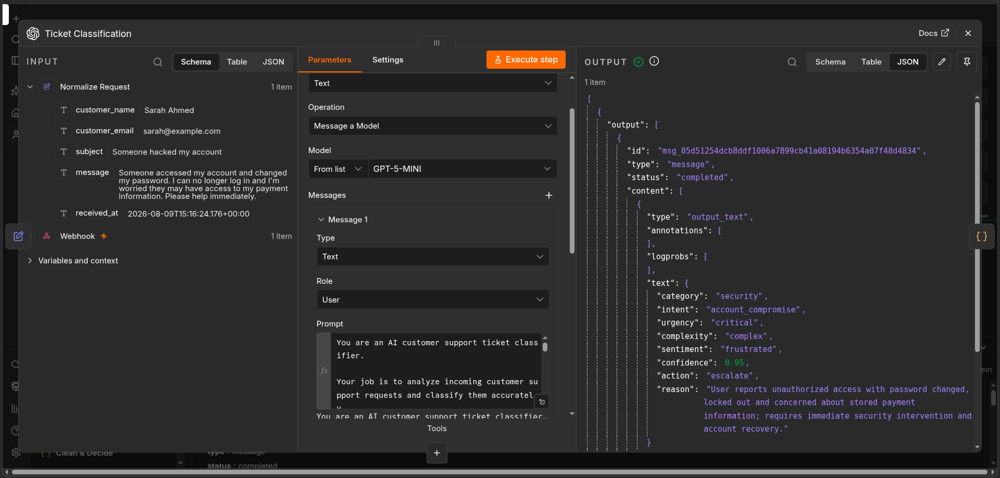
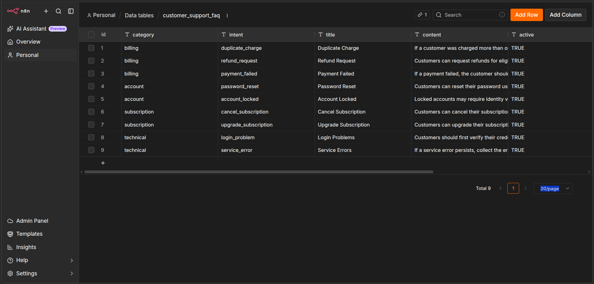
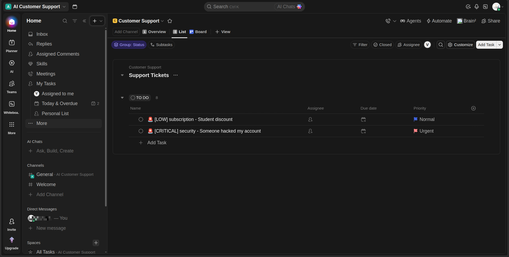
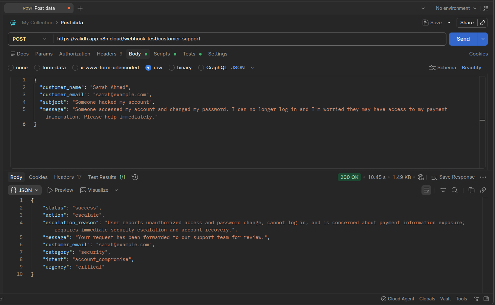

# AI Customer Support Automation

An AI-powered customer support automation workflow built with **n8n, OpenAI API, n8n Data Tables, and ClickUp**.

The system receives customer support requests through a webhook, classifies them using AI, applies deterministic business rules, checks a support knowledge base (n8n Data Table), generates responses for supported requests, and automatically escalates complex or unsupported cases to a human support team through ClickUp.

---

## Features

* AI-powered customer request classification
* Automatic category and intent detection
* Urgency and complexity assessment
* Sentiment detection
* AI confidence scoring
* Deterministic business rules for escalation
* Knowledge-base lookup using n8n Data Tables
* AI-generated customer responses
* Prevents unsupported AI-generated answers
* Human escalation through ClickUp
* Automatic ClickUp priority based on urgency
* REST-style webhook API
* Clean JSON API responses
* Postman/cURL testing

---

## Architecture

```text
                    Customer Request
                           │
                           ▼
                     ┌──────────┐
                     │  Webhook │
                     └────┬─────┘
                          │
                          ▼
                  Normalize Request
                          │
                          ▼
                 AI Ticket Classification
                          │
                          ▼
                    Clean & Decide
                          │
                    ┌─────┴────────┐
                    │              │
                 RESPOND           │
                    │              │
                    ▼              │
              Query Support        |
                    │              |
                    ▼              |
                 Check FAQ         |
                 ┌────┴────┐       |
                 │         │       |
               FOUND    NOT FOUND  |
                 │         │       |
                 ▼         └───┬───┘
           Generate            |
            Response        Escalate
                 │             |
                 ▼             ▼
           Clean Response   ClickUp
                 │             │
                 ▼             ▼
          JSON Response   JSON Response
```

---

## Screenshots

### Workflow Overview



### AI Classification



### Knowledge Base



### ClickUp Escalation



### Postman Testing



## Workflow

### 1. Receive Customer Request

The workflow starts with an HTTP `POST` webhook.

Example request:

```json
{
  "customer_name": "John Doe",
  "customer_email": "john@example.com",
  "subject": "Charged twice for subscription",
  "message": "I was charged twice for my subscription this month. I would like a refund for the duplicate charge."
}
```

---

### 2. Normalize Request

The incoming request is converted into a consistent structure containing:

* Customer name
* Customer email
* Subject
* Message
* Received timestamp

This gives the rest of the workflow a predictable data structure.

---

### 3. AI Ticket Classification

OpenAI analyzes the customer request and returns structured classification data.

Example:

```json
{
  "category": "billing",
  "intent": "duplicate_charge",
  "urgency": "medium",
  "complexity": "simple",
  "sentiment": "frustrated",
  "confidence": 0.9,
  "action": "respond",
  "reason": "Customer reports being charged twice for a subscription and requests a refund."
}
```

The classifier uses predefined categories and intents instead of allowing the model to invent arbitrary intent values.

---

### 4. Clean & Decide

A JavaScript Code node normalizes the AI output and applies deterministic business rules.

The workflow escalates when:

* AI recommends escalation
* Urgency is `critical`
* Complexity is `complex`
* Confidence is below `0.75`
* Category is `security`

The final decision becomes:

```text
respond
```

or:

```text
escalate
```

This creates a deterministic decision layer around the AI classification.

---

## Query Data Table

Requests selected for automatic response are checked against an n8n Data Table containing approved support information.

The lookup matches:

```text
category
intent
active
```

Only active matching support information is used to generate the customer response.

This prevents the AI from answering based purely on its general knowledge.

---

## Automatic Response

When a matching FAQ exists, OpenAI generates a concise customer-facing response using the supplied support information.

The response-generation prompt instructs the model to:

* Use only the provided support information
* Avoid inventing company policies
* Avoid unsupported refunds or guarantees
* Avoid claiming actions have already been completed
* Avoid exposing internal workflow information

Example:

```text
Hi John — I’m sorry for the inconvenience.

I can verify the duplicate transaction and initiate a refund for
the extra charge. Refunds normally appear within 5–7 business
days after they are processed.

Please reply with the date and amount of the duplicate charge...
```

---

## Escalation

If the request requires human assistance, the workflow creates a ClickUp support task.

Escalation can happen because of:

```text
AI recommendation
        OR
Critical urgency
        OR
Complex request
        OR
Low AI confidence
        OR
Security-related request
        OR
No matching FAQ
```

Example:

```text
🚨 [CRITICAL] security - Someone hacked my account
```

The task contains the information required for a support agent to investigate the issue.

### ClickUp Priority Mapping

| AI Urgency | ClickUp Priority |
| ---------- | ---------------- |
| Critical   | Urgent           |
| High       | High             |
| Medium     | Normal           |
| Low        | Low              |

---

## Data Table Fallback

An important part of the workflow is what happens when the AI wants to respond but the data able doesn't contain a suitable answer.

Instead of allowing the AI to guess:

```text
AI Decision
    │
    ▼
Respond
    │
    ▼
Data Table
    │
    ▼
No matching FAQ
    │
    ▼
Escalate
    │
    ▼
ClickUp
```

The escalation reason is:

```text
No matching data table article found
```

This provides a safer fallback for unsupported customer questions.

---

## Example Test Cases

### Test 1 — Automatic Response

**Request**

```json
{
  "customer_name": "John Doe",
  "customer_email": "john@example.com",
  "subject": "Charged twice for subscription",
  "message": "I was charged twice for my subscription this month. I would like a refund for the duplicate charge."
}
```

**Expected**

```text
Action: respond
Category: billing
Intent: duplicate_charge
```

The workflow retrieves the relevant FAQ and generates a customer response.

---

### Test 2 — Critical Escalation

**Request**

```json
{
  "customer_name": "Sarah Ahmed",
  "customer_email": "sarah@example.com",
  "subject": "Someone hacked my account",
  "message": "Someone accessed my account and changed my password. I can no longer log in and I'm worried they may have access to my payment information. Please help immediately."
}
```

**Expected**

```text
Action: escalate
Category: security
Intent: account_compromise
Urgency: critical
```

A high-priority ClickUp task is created for human review.

---

### Test 3 — Data Table Fallback

**Request**

```json
{
  "customer_name": "David Ahmed",
  "customer_email": "david@example.com",
  "subject": "Student discount",
  "message": "I'm a university student. Do you offer any student discounts for the annual subscription?"
}
```

**Expected**

```text
Action: escalate
Category: subscription
Intent: other
Escalation reason: No matching knowledge base article found
```

The request is escalated instead of generating an unsupported answer.

---

## API Response

### Automatic Response

```json
{
  "status": "success",
  "action": "respond",
  "customer_email": "john@example.com",
  "category": "billing",
  "intent": "duplicate_charge",
  "response": "Hi John — I’m sorry for the inconvenience..."
}
```

### Escalation

```json
{
  "status": "success",
  "action": "escalate",
  "message": "Your request has been forwarded to our support team for review.",
  "customer_email": "sarah@example.com",
  "category": "security",
  "intent": "account_compromise",
  "urgency": "critical"
}
```

---

## Tech Stack

| Technology             | Purpose                                   |
| ---------------------- | ----------------------------------------- |
| **n8n**                | Workflow automation and orchestration     |
| **OpenAI API**         | AI classification and response generation |
| **n8n Data Tables**    | Support knowledge base                    |
| **ClickUp**            | Human support ticket management           |
| **JavaScript**         | Data cleaning and business logic          |
| **Webhook / REST API** | Receive customer requests                 |
| **Postman / cURL**     | API testing                               |

---

## Project Structure

```text
ai-customer-support-automation/
│
├── README.md
│
├── workflow/
│   └── ai-customer-support-automation.json
│
└── screenshots/
    ├── workflow-overview.png
    ├── ai-classification.png
    ├── knowledge-base.png
    ├── clickup-escalation.png
    └── postman-tests.png

```

---

## Setup

### Requirements

* n8n
* OpenAI API access
* ClickUp account
* Postman or cURL

### 1. Import the Workflow

Import:

```text
workflow/ai-customer-support-automation.json
```

into your n8n instance.

### 2. Configure Credentials

After importing, configure your own:

* OpenAI credential
* ClickUp credential

### 3. Configure Data Table

Create the required n8n Data Table and add the support FAQ records used by the workflow.

### 4. Activate the Workflow

Activate the workflow and use the generated webhook URL.

### 5. Send a Test Request

```bash
curl -X POST "YOUR_N8N_WEBHOOK_URL" \
  -H "Content-Type: application/json" \
  -d '{
    "customer_name": "John Doe",
    "customer_email": "john@example.com",
    "subject": "Charged twice for subscription",
    "message": "I was charged twice for my subscription this month. I would like a refund for the duplicate charge."
  }'
```

---

## Security

Never commit credentials or secrets to GitHub.

The workflow file included in this repository should not contain:

* OpenAI API keys
* ClickUp tokens
* OAuth secrets
* Passwords
* Webhook secrets
* `.env` files containing credentials

Configure credentials through n8n after importing the workflow.

---

## Future Improvements

Potential production improvements include:

* Email integration for delivering customer responses
* Persistent support-ticket logging
* Support-agent assignment
* ClickUp custom fields
* SLA monitoring
* Analytics dashboard
* Retry and failure handling
* Conversation history
* More advanced knowledge retrieval
* Authentication for the webhook endpoint

---

## Project Purpose

This project demonstrates how AI can be combined with deterministic automation and human escalation to build a practical customer support workflow.

Rather than allowing an LLM to independently handle every request, the system uses:

```text
AI Classification
       +
Business Rules
       +
Trusted Data Table
       +
Human Escalation
```

to create a more controlled and reliable support automation workflow.
