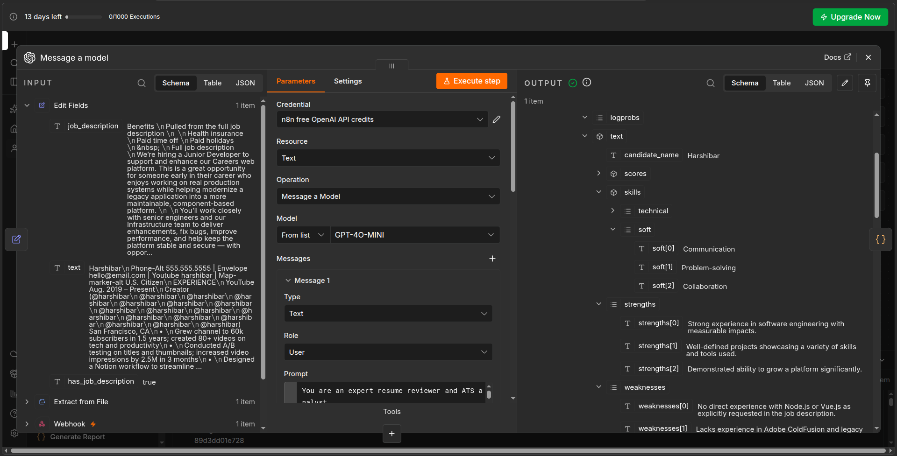
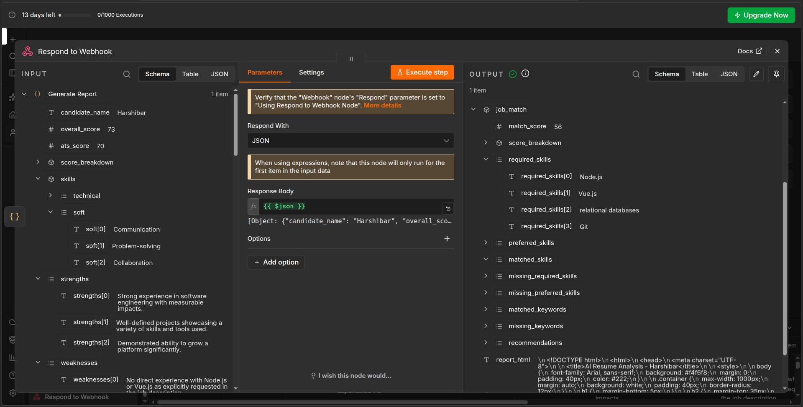

# AI Resume Analyzer

An AI-powered resume analysis and job-matching automation built with **n8n** and **OpenAI**.

The workflow accepts a resume PDF and an optional job description, extracts the resume text, analyzes it using a structured OpenAI response, calculates deterministic scores in n8n, and generates a structured analysis and HTML report.

## Overview

The project automates resume evaluation and job matching through an n8n workflow.

Users can submit:

* A resume in PDF format
* An optional job description

The system analyzes the resume and returns:

* Overall resume score
* ATS compatibility score
* Category-level scoring
* Technical and soft skills
* Resume strengths
* Areas for improvement
* Actionable recommendations
* Job compatibility score
* Matched skills
* Missing required skills
* Missing preferred skills
* Matched and missing keywords
* Job-specific recommendations
* HTML report

## Features

### Resume Analysis

The workflow evaluates:

* Professional summary
* Work experience
* Skills
* Projects
* Education
* Formatting
* ATS compatibility

Each category receives a score from 0–10.

### Deterministic Scoring

The final scores are calculated by JavaScript inside n8n rather than generated directly by the AI.

**Overall Resume Score**

| Category   | Weight |
| ---------- | -----: |
| Summary    |    10% |
| Experience |    25% |
| Skills     |    15% |
| Projects   |    15% |
| Education  |    10% |
| Formatting |    10% |
| ATS        |    15% |

**Job Match Score**

| Category   | Weight |
| ---------- | -----: |
| Skills     |    35% |
| Experience |    30% |
| Keywords   |    20% |
| Projects   |    15% |

This keeps the scoring logic transparent and reproducible.

### Job Description Matching

When a job description is provided, the workflow identifies:

* Required skills
* Preferred skills
* Matched skills
* Missing required skills
* Missing preferred skills
* Matched keywords
* Missing keywords
* Job-specific recommendations

The AI is instructed not to assume that one technology automatically implies another.

For example:

```text
React ≠ Angular
Python ≠ Java
Git ≠ GitHub Actions
```

## Workflow

```text
Resume PDF + Job Description
            │
            ▼
        Webhook
            │
            ▼
    Extract From File
            │
            ▼
       Edit Fields
            │
            ▼
          OpenAI
            │
            ▼
     Code Node
  Clean + Calculate Scores
            │
            ▼
    Generate HTML Report
            │
            ▼
   Respond to Webhook
```

## Architecture

```text
┌─────────────────────┐
│       Client        │
│                     │
│ Resume PDF          │
│ Job Description     │
└──────────┬──────────┘
           │
           ▼
┌─────────────────────┐
│       n8n           │
│                     │
│ Webhook             │
│ PDF Extraction      │
│ Data Preparation    │
└──────────┬──────────┘
           │
           ▼
┌─────────────────────┐
│      OpenAI         │
│                     │
│ Resume Analysis     │
│ Job Matching        │
│ Structured Output   │
└──────────┬──────────┘
           │
           ▼
┌─────────────────────┐
│     JavaScript      │
│                     │
│ Score Calculation   │
│ Data Transformation │
└──────────┬──────────┘
           │
           ▼
┌─────────────────────┐
│    HTML Report      │
└──────────┬──────────┘
           │
           ▼
┌─────────────────────┐
│ Webhook Response    │
└─────────────────────┘
```

## Screenshots

### n8n Workflow


### Resume Analysis



### Job Matching



## Tech Stack

* **n8n** — Workflow automation
* **OpenAI API** — Resume analysis and job matching
* **JavaScript** — Data transformation and deterministic scoring
* **Webhook API** — Resume submission and response
* **PDF extraction** — Resume text extraction
* **HTML/CSS** — Report generation
* **Postman** — API testing

## How It Works

### 1. Resume Upload

The Webhook receives a multipart/form-data request containing the resume PDF and optional job description.

### 2. PDF Extraction

The uploaded PDF is processed by n8n and converted into text.

### 3. Data Preparation

The extracted resume text and job description are prepared for the AI analysis.

### 4. AI Analysis

OpenAI analyzes the resume using a structured JSON schema.

The model evaluates the resume and, when a job description is provided, compares the candidate's qualifications against the position.

### 5. Score Calculation

The JavaScript Code node applies predefined weights to the AI-generated category scores.

This separates qualitative AI evaluation from deterministic business logic.

### 6. Report Generation

The workflow transforms the structured result into an HTML report.

### 7. API Response

The `Respond to Webhook` node returns the final structured result to the client.

## API Usage

### Endpoint

```text
POST /webhook/resume-analyzer
```

### Content Type

```text
multipart/form-data
```

### Parameters

| Field             | Type | Required |
| ----------------- | ---- | -------- |
| `resume`          | File | Yes      |
| `job_description` | Text | No       |

Example request:

```text
resume = resume.pdf
job_description = Junior Software Engineer job description...
```

## Example Result

```json
{
  "candidate_name": "John Doe",
  "overall_score": 75,
  "ats_score": 70,
  "job_match": {
    "match_score": 68,
    "matched_skills": [
      "Python",
      "Java",
      "JavaScript"
    ],
    "missing_required_skills": [
      "Docker"
    ]
  }
}
```

## Project Structure

```text
ai-resume-analyzer/
│
├── README.md
│
├── workflow/
│   └── ai-resume-analyzer.json
│
├── screenshots/
│   ├── workflow.png
│   ├── resume-analysis.png
│   └── job-match.png
│
├── sample-output.json
│
└── .gitignore
```

## Setup

1. Install or create an n8n instance.
2. Import the workflow from `workflow/ai-resume-analyzer.json`.
3. Configure an OpenAI credential in n8n.
4. Activate the workflow.
5. Send a multipart/form-data request to the webhook.
6. Provide a resume PDF and optionally a job description.

## Limitations

* Resume quality depends on the quality of extracted PDF text.
* AI-generated evaluations are not a substitute for professional recruitment decisions.
* Job matching depends on how clearly requirements are described in the job description.
* Scoring weights are predefined and can be adjusted for different use cases.
* The current version does not perform OCR for image-only PDFs.

## Future Improvements

Potential improvements include:

* OCR support for scanned resumes
* Frontend interface for resume uploads
* Persistent analysis history
* Database integration
* Email delivery of reports
* PDF report generation
* Resume improvement suggestions
* Multiple job description comparison
* Authentication and rate limiting
* Dashboard for analyzing multiple candidates

## Author

Built as a portfolio project to demonstrate workflow automation, API integration, AI application development, structured LLM output, and data processing with n8n.

