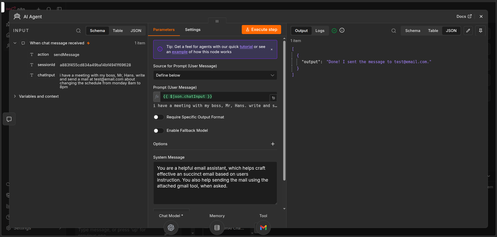
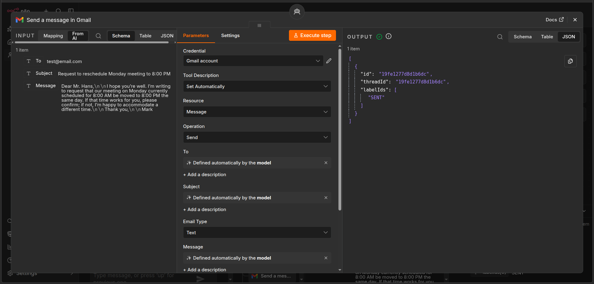

# Gmail Assistant — n8n + OpenAI

An AI-powered Gmail assistant built with **n8n, OpenAI, and Gmail**.

The assistant provides a conversational interface for drafting concise, effective emails and can send emails through Gmail when explicitly requested.

## Overview

Instead of manually writing and sending every email, the user can interact with the assistant through an n8n chat interface.

The AI agent understands the user's request, drafts an appropriate email, and can use the connected Gmail tool to send it.

```text
User
 │
 ▼
n8n Chat Trigger
 │
 ▼
AI Agent
 ├── OpenAI Chat Model
 ├── Simple Memory
 └── Gmail Tool
       │
       ▼
    Send Email
```
## Screenshots

### Workflow Overview


### AI Agent Configuration



### Example Result



## Features

* Conversational email assistance
* AI-generated email drafting
* Concise and context-aware email writing
* Gmail integration for sending messages
* AI-controlled recipient, subject, and message fields
* Conversation memory for maintaining context
* Explicit tool-based email sending
* Built with n8n's AI Agent architecture

## Example Requests

The assistant can handle requests such as:

```text
Write an email to my professor asking for an extension on my assignment.
```

```text
Draft a professional reply accepting the interview invitation.
```

```text
Write a short follow-up email about my job application.
```

When the user wants to send the email, the assistant can use the connected Gmail tool.

```text
Send it to john@example.com.
```

## Workflow Components

### 1. Chat Trigger

The workflow starts with the **When chat message received** node.

It accepts the user's natural-language request and passes the chat input to the AI Agent.

### 2. AI Agent

The AI Agent is the central component of the workflow.

Its system instructions define it as an email assistant that helps users create effective and concise emails and can send messages using the attached Gmail tool when requested.

The agent receives the user's chat input and decides how to respond or whether to use the Gmail tool.

### 3. OpenAI Chat Model

The agent uses **GPT-5 mini** as its language model.

OpenAI handles:

* Understanding the user's request
* Generating email content
* Maintaining conversational context
* Deciding when the Gmail tool should be used

### 4. Simple Memory

The workflow includes n8n's **Simple Memory** node.

This allows the assistant to maintain conversation context across messages, making multi-step interactions possible.

For example:

```text
User:
Write an email asking for an interview update.

Assistant:
[Drafts email]

User:
Make it shorter and more professional.

Assistant:
[Revises the previous email]
```

### 5. Gmail Tool

The Gmail node is connected to the AI Agent as an AI tool rather than being a normal sequential workflow node.

The agent can provide:

* Recipient
* Subject
* Message

to the Gmail tool when sending an email.

This architecture allows the AI Agent to decide when email sending is appropriate instead of automatically sending every generated response.

## Tech Stack

* **n8n** — workflow automation and AI agent orchestration
* **OpenAI GPT-5 mini** — natural-language understanding and email generation
* **Gmail** — email delivery
* **n8n Simple Memory** — conversation context

## Workflow Structure

```text
When chat message received
          │
          ▼
       AI Agent
       /   |   \
      /    |    \
     ▼     ▼     ▼
 OpenAI  Memory  Gmail
 Model            Tool
                    │
                    ▼
                Send Email
```

The OpenAI model and memory are connected to the AI Agent through n8n's AI connections, while Gmail is exposed as an AI tool.

## Setup

### 1. Import the Workflow

Import `workflow.json` into your n8n instance.

### 2. Configure OpenAI

Create or connect your own OpenAI credential and select the desired chat model.

### 3. Configure Gmail

Connect your own Gmail OAuth credential to the Gmail tool.

The repository does **not** contain the actual authentication tokens.

### 4. Open the Chat Interface

Run the workflow and interact with the assistant through the n8n chat interface.

Example:

```text
Write a professional email to a recruiter
asking about the status of my application.
```

Review the generated email before asking the assistant to send it.

## Project Structure

```text
gmail-assistant/
├── README.md
├── workflow.json
└── screenshots/
    ├── workflow.png
    ├── chat-interface.png
    └── gmail-result.png
```

## Security

This workflow requires access to both OpenAI and Gmail.

**Never commit:**

* OpenAI API keys
* Gmail OAuth tokens
* Passwords
* Private credentials
* Private email content

Use your own credentials after importing the workflow.

The exported workflow may contain n8n credential references, but the actual authentication secrets should not be included in the repository.

## Important Consideration

This workflow gives an AI agent the ability to send emails.

For real-world use, users should review generated emails and recipients before sending sensitive or important messages.

The Gmail tool should only be used when the user explicitly requests that an email be sent.

## Possible Improvements

Future versions could include:

* Email reply assistance
* Gmail inbox search
* Email summarization
* Automatic attachment handling
* Draft-only mode
* Confirmation before sending
* Email classification
* Calendar integration
* Contact lookup
* Different writing styles for different recipients

## License

This project is provided for educational and portfolio purposes.
