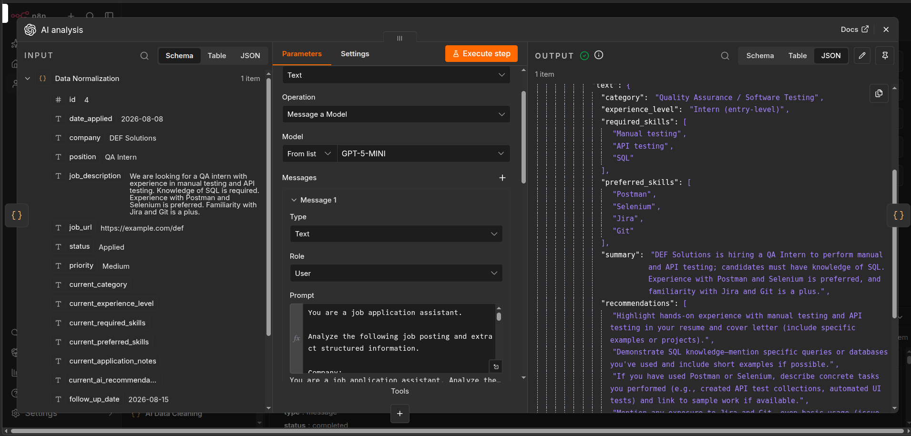
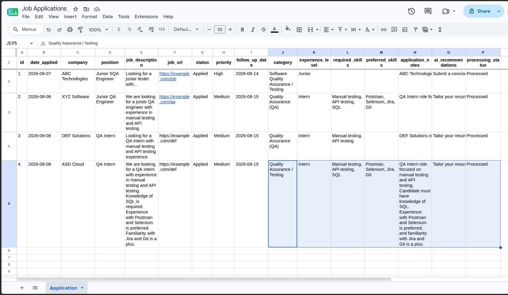

# Job Application Tracker — n8n + OpenAI

An automated job application tracking workflow built with **n8n, Google Sheets, and OpenAI**.

The workflow monitors new job application records, analyzes job descriptions using OpenAI, extracts structured information such as required and preferred skills, generates application recommendations, and writes the results back to Google Sheets.

## Workflow

```text
Google Sheets
      ↓
Data Normalization
      ↓
OpenAI
      ↓
AI Data Cleaning
      ↓
Update Google Sheet
```

## Screenshots

### Complete Workflow


### OpenAI Analysis



### Google Sheets Result



## Features

* Monitors job applications from Google Sheets
* Processes only applications marked as `New`
* Validates and normalizes application data
* Uses OpenAI to analyze job descriptions
* Extracts:

  * Job category
  * Experience level
  * Required skills
  * Preferred skills
  * Application summary
  * Application recommendations
* Converts AI output into a clean spreadsheet-friendly format
* Automatically updates the corresponding application
* Changes `processing_status` from `New` to `Processed`
* Uses structured JSON output from OpenAI for predictable results

## Tech Stack

* **n8n** — workflow automation
* **OpenAI API** — job description analysis
* **Google Sheets** — application database
* **JavaScript** — data validation and transformation

## Workflow Details

### 1. Google Sheets Trigger

The workflow starts from a Google Sheets trigger.

The spreadsheet contains application information such as:

```text
id
date_applied
company
position
job_description
job_url
status
priority
category
experience_level
required_skills
preferred_skills
application_notes
ai_recommendations
follow_up_date
processing_status
```

### 2. Data Normalization

The Code node filters incoming records based on:

```text
processing_status = New
```

It also validates important fields such as:

* Company
* Position
* Job description

Invalid or incomplete records are rejected before they reach the AI stage.

### 3. OpenAI Analysis

The OpenAI node analyzes the job description and extracts structured information.

The model is instructed to:

* Identify the job category
* Identify the experience level
* Extract explicitly stated required skills
* Extract explicitly stated preferred skills
* Generate a concise role summary
* Generate practical application recommendations
* Avoid inventing requirements or skills

The workflow uses a JSON Schema response format to keep the AI output predictable.

### 4. AI Data Cleaning

The AI response is transformed into spreadsheet-friendly values.

Arrays such as required skills and recommendations are converted into strings before being written to Google Sheets.

### 5. Update Google Sheet

The workflow updates the application using the application's `id` as the matching column.

After successful processing:

```text
processing_status → Processed
```

This prevents the same application from being processed repeatedly.

## Example

A job description such as:

```text
Looking for a QA intern with manual testing and API testing experience.
```

can produce:

```text
Category:
Quality Assurance (QA)

Experience Level:
Intern

Required Skills:
Manual testing, API testing

Preferred Skills:
None
```

along with an application summary and AI-generated recommendations.

## Setup

### 1. Import the workflow

Import `workflow.json` into your n8n instance.

### 2. Configure credentials

Connect your own:

* Google Sheets credential
* OpenAI credential

**Credentials are not included in this repository.**

### 3. Configure Google Sheets

Create a spreadsheet with the required columns listed above.

Update the Google Sheets nodes to point to your own spreadsheet.

### 4. Add a new application

Add a job application with:

```text
processing_status = New
```

Then execute the workflow.

The application will be analyzed and updated automatically.

## Project Structure

```text
job-application-tracker/
├── README.md
├── workflow.json
└── screenshots/
    ├── workflow.png
    ├── ai-analysis.png
    └── google-sheets-result.png
```

## Security

The exported workflow does not contain the actual API credentials.

Before publishing, make sure the workflow does not expose:

* API keys
* OAuth tokens
* Passwords
* Private credentials
* Personal application data
* Private spreadsheet information

Use your own test spreadsheet and sample job applications when publishing the project.

## Future Improvements

* Scheduled processing
* Email notifications for high-priority applications
* Automatic follow-up reminders
* Job-status notifications
* Application statistics and dashboards

## License

This project is provided for educational and portfolio purposes.
