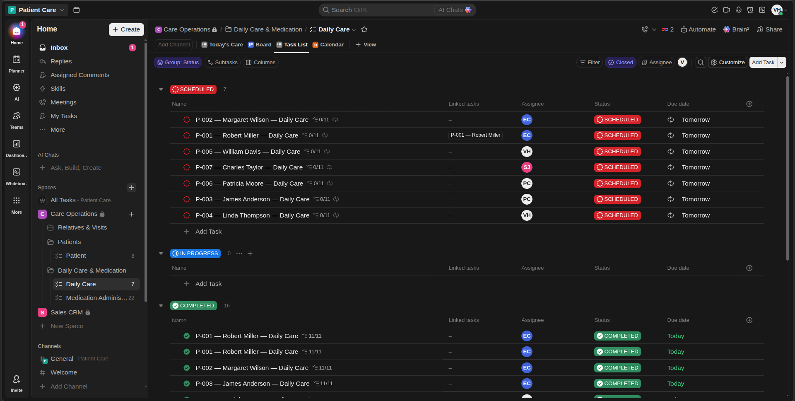
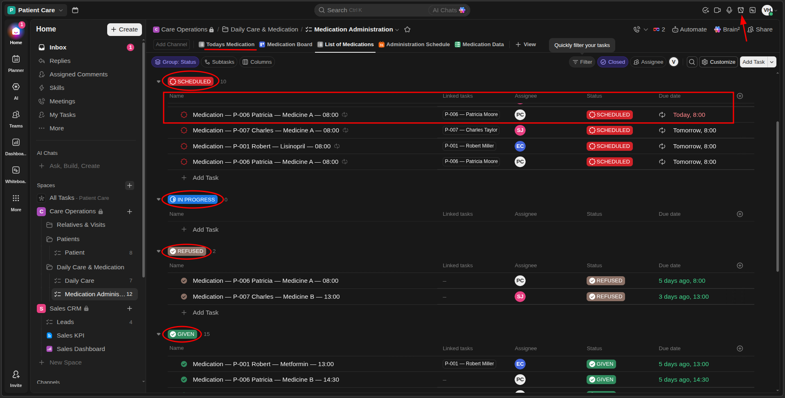
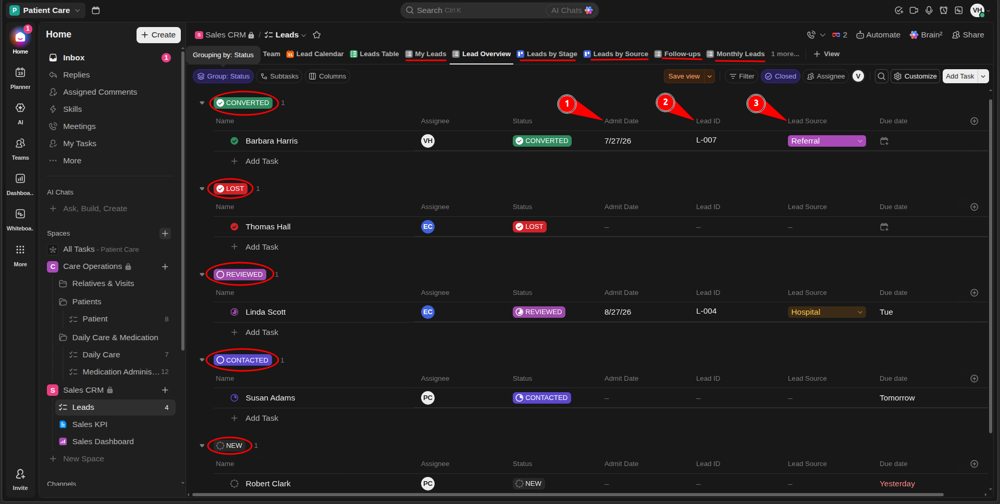
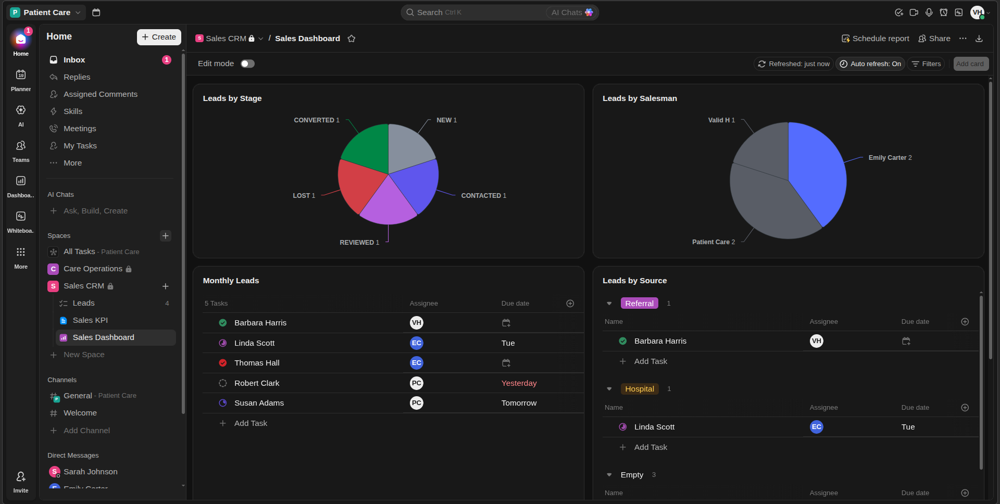
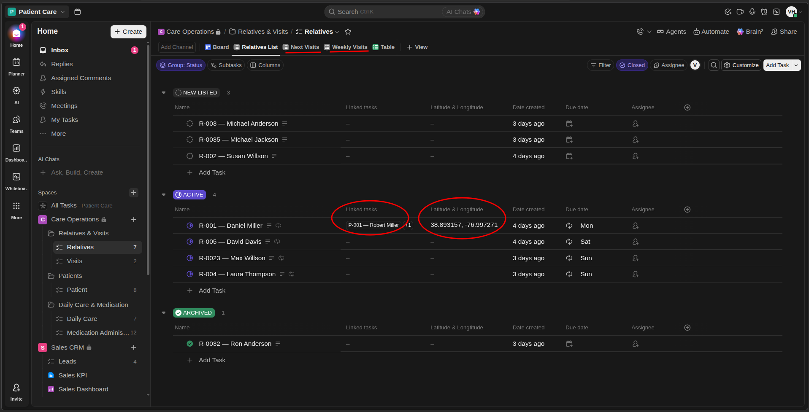
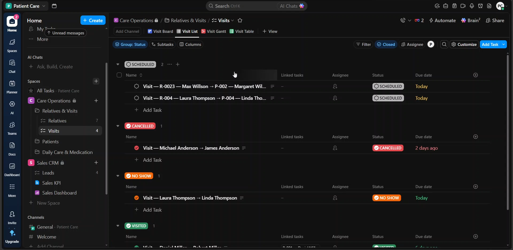
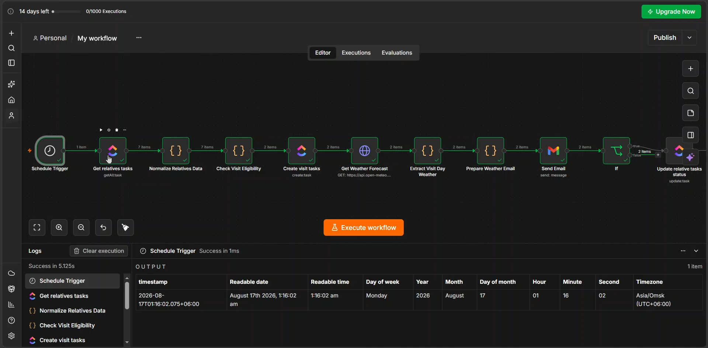
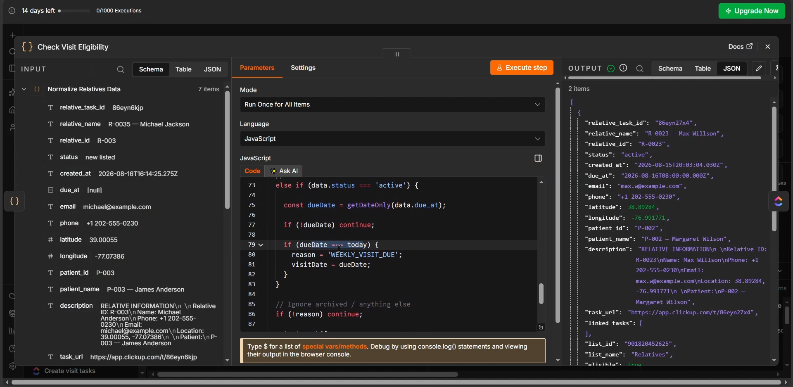
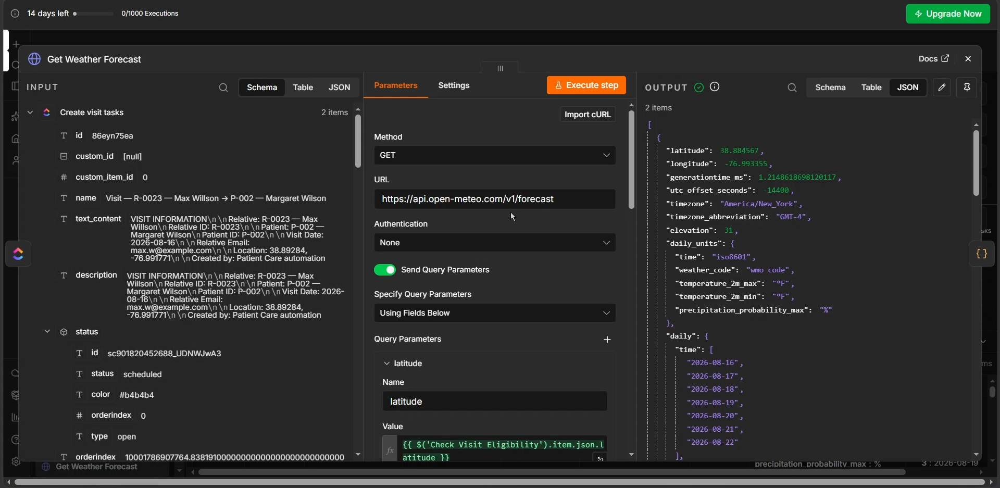
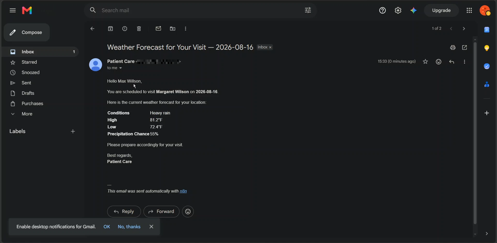

# Patient Care Facility — ClickUp + n8n Automation

A business-focused operations and automation case study for a US assisted-living facility, built with **ClickUp** and **n8n**.

The solution was designed around the facility's operational requirements: caregiver task management, medication administration, sales CRM, relative/visit management, and automated visit-day weather communication.

> **Note:** This repository contains synthetic/demo data only. No real patient, relative, or facility credentials are included.

---

## 📌 Overview

Patient Care operates an assisted-living facility with:

- A 1:3 caregiver-to-patient policy
- Routine daily care activities
- Approximately 3 medications per patient
- A phone-based sales team
- Weekly/recurring relative visits

The project was approached as an **operations system design problem**, rather than simply creating isolated automations.

### Solution architecture

```text
                         PATIENT CARE
                              │
                ┌─────────────┴─────────────┐
                │                           │
             CLICKUP                       n8n
      Operational System               Automation Layer
                │                           │
     ┌──────────┼──────────┐                │
     │          │          │                │
 Patient     Sales      Relatives           │
 Operations   CRM        & Visits           │
     │          │          │                │
 Daily Care  Leads       Visit schedule ────┤
 Medication  Pipeline     Coordinates       │
     │          │          │                ▼
     └──────────┴──────────┘          Open-Meteo API
                                            │
                                            ▼
                                          Gmail
                                            │
                                            ▼
                                    Relative receives
                                    visit-day forecast
```

---

## 🎯 Problems Identified

### 1. Caregiver task management

Caregivers perform recurring daily activities for individual patients. The facility needs a central task system so responsibilities are visible and incomplete care can be identified.

### 2. Medication administration

Each patient has multiple routine medications. Caregivers need to know the patient, medication, scheduled time, administration outcome, and record when medication is refused.

### 3. Sales and lead management

The sales team needs a centralized CRM to track leads, pipeline stages, lead sources, follow-ups, and conversions.

### 4. Sales reporting

Management needs monthly visibility into lead volume, lead stages, lead sources, and conversion performance.

### 5. Relative and visit management

The facility needs a structured list of patient relatives, including contact information, linked patients, location coordinates, and recurring visit management.

### 6. Visit-day communication

Relatives should receive weather information for the day of their scheduled visit so they can prepare accordingly.

---

## 💡 Solution

### ClickUp — Operations System

ClickUp is used as the central operational system for:

- Patient records
- Recurring daily-care tasks and checklists
- Medication administration
- Caregiver assignment
- Sales CRM and pipeline
- Sales reporting views/dashboard
- Relative directory
- Weekly visitor management
- Individual visit records

The design deliberately favors native ClickUp features such as **tasks, statuses, due dates, assignees, descriptions, linked tasks, recurring tasks, and views** to minimize unnecessary Custom Field usage.

### n8n — Automation Layer

n8n handles automation and external API integration.

The demonstrated automation:

1. Runs on a schedule.
2. Retrieves relative records from ClickUp.
3. Identifies relatives whose visit is due.
4. Handles both new-relative first visits and active weekly visitors.
5. Creates the corresponding Visit task in ClickUp.
6. Uses the relative's latitude/longitude to retrieve a weather forecast from Open-Meteo.
7. Builds a personalized email.
8. Sends the email through Gmail.

---

## 🧩 ClickUp Implementation

### Care Operations

```text
Care Operations
├── Patients
├── Daily Care
│   └── Daily Care Tasks
├── Medication Management
│   └── Medication Administration
└── Relatives & Visits
    ├── Relatives
    └── Visits
```

### Daily Care

Each patient has a recurring daily-care task with a checklist of activities. Caregivers can see assigned work and update task status as care progresses.

Example workflow:

```text
SCHEDULED → IN PROGRESS → COMPLETED
```

Tasks recur daily with a fresh checklist.

### Medication

Medication administration is tracked as individual tasks.

The task captures:

- Patient
- Medication
- Scheduled administration time
- Caregiver/assignee
- Administration status
- Refusal notes

Example workflow:

```text
SCHEDULED → IN PROGRESS → GIVEN
                        └→ REFUSED
```

### Sales CRM

The Leads List uses statuses to represent the sales pipeline:

```text
NEW → CONTACTED → REVIEWED → WON
                       └──────→ LOST
```

Main CRM fields:

- Lead ID
- Lead Source
- Expected ADMIT DATE

Native ClickUp fields are used for salesperson assignment and follow-up dates.

### Relative & Visit Management

The **Relatives** List acts as the ongoing relative directory, while the **Visits** List stores individual visit records.

Relative information includes:

- Relative ID
- Name
- Phone
- Email
- Linked patient
- Latitude & longitude
- Visitor status
- Next visit date

Visit records use statuses such as:

```text
SCHEDULED → VISITED
          ├→ CANCELLED
          └→ NO SHOW
```

---

## ⚙️ n8n Automation — Relative Visit Weather Notification

### Workflow

```text
Schedule Trigger
       ↓
Get Relatives from ClickUp
       ↓
Normalize Relative Data
       ↓
Check Visit Eligibility
       ↓
Create Visit in ClickUp
       ↓
Open-Meteo Weather API
       ↓
Extract Visit-Day Forecast
       ↓
Prepare Weather Email
       ↓
Gmail
```

### Visit eligibility logic

**New relative:**

```text
Creation date + 3 days = today
        ↓
First visit is due
```

**Active weekly visitor:**

```text
ClickUp due date = today
        ↓
Weekly visit is due
```

Only eligible relatives continue through the automation.

### Weather lookup

The workflow uses each relative's own latitude and longitude. This means relatives visiting the same patient can still receive different forecasts if they live in different locations.

### Email

Each eligible relative receives a personalized email containing:

- Visit date
- Patient name
- Weather condition
- Forecast high
- Forecast low
- Precipitation probability

---

## 🖼️ Screenshots

Screenshots are included to document both the **business setup** and the **working automation**.

### ClickUp Screenshots

#### Daily Care Task



#### Medication Administration



#### Sales CRM Pipeline



#### Sales Dashboard



#### Relatives List



#### Visits List



### n8n Screenshots

#### Complete Automation Workflow



#### Eligibility / Data Processing



#### Weather API Result



#### Email Result



---


## 📊 Business Rules & Assumptions

- The facility's historical lead-to-patient conversion rate of **22%** is treated as a benchmark; actual conversion is derived from CRM outcomes.
- The relationship between the stated rooms, apartments, and four-bed apartment is not sufficiently defined to calculate total facility capacity.
- The 14-month average stay is treated as a historical KPI rather than a capacity calculation.
- The caregiver 1:3 policy is used as an operational staffing constraint.
- Relative latitude/longitude is stored directly for weather lookup; geocoding is not required.
- Synthetic data is used for all demonstration records.
- ClickUp Free-plan limitations and the **60 Custom Field-use constraint** influenced the data model.

---

## 🔐 Security & Privacy

This project uses synthetic patient and relative information for demonstration purposes.

Do not commit:

- ClickUp API tokens
- Gmail credentials
- n8n credentials
- OAuth secrets
- API keys
- Real patient/relative information

Credentials should be stored in n8n's credential manager or environment/secret management rather than inside exported workflow JSON.

---

## 🛠️ Tech Stack

| Tool | Purpose |
|---|---|
| **ClickUp** | Operations, task management, medication tracking, CRM, relative/visit management |
| **n8n** | Workflow automation and business logic |
| **Open-Meteo** | Weather forecast API |
| **Gmail** | Automated relative email notification |

---

## ✅ Project Outcome

The project demonstrates an end-to-end business workflow rather than a standalone automation:

```text
Business Requirements
        ↓
ClickUp Operating System
        ↓
n8n Automation
        ↓
External Weather API
        ↓
Personalized Email
```

The result is a lightweight assisted-living operations system with a practical automation layer that can be extended with additional notifications, reporting automation, and operational controls.
